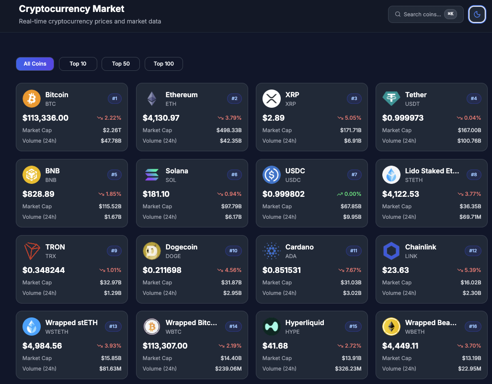
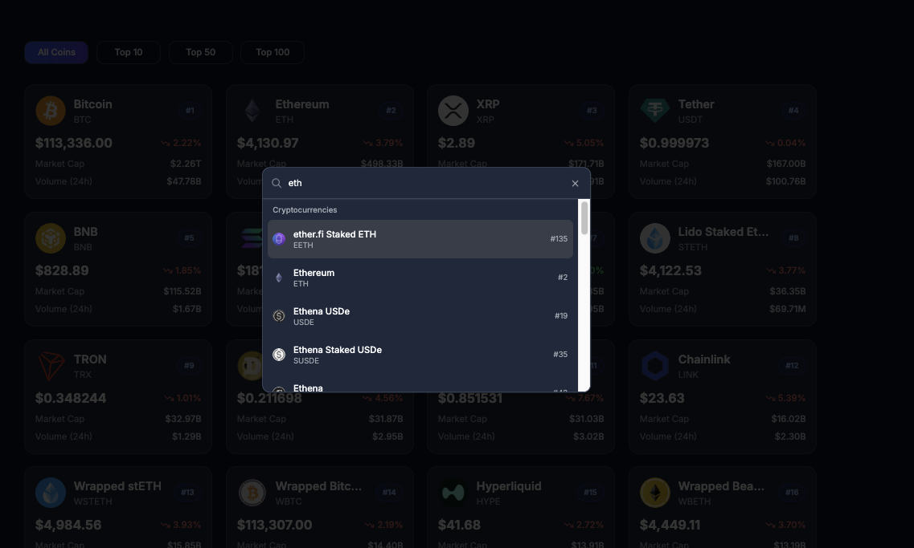
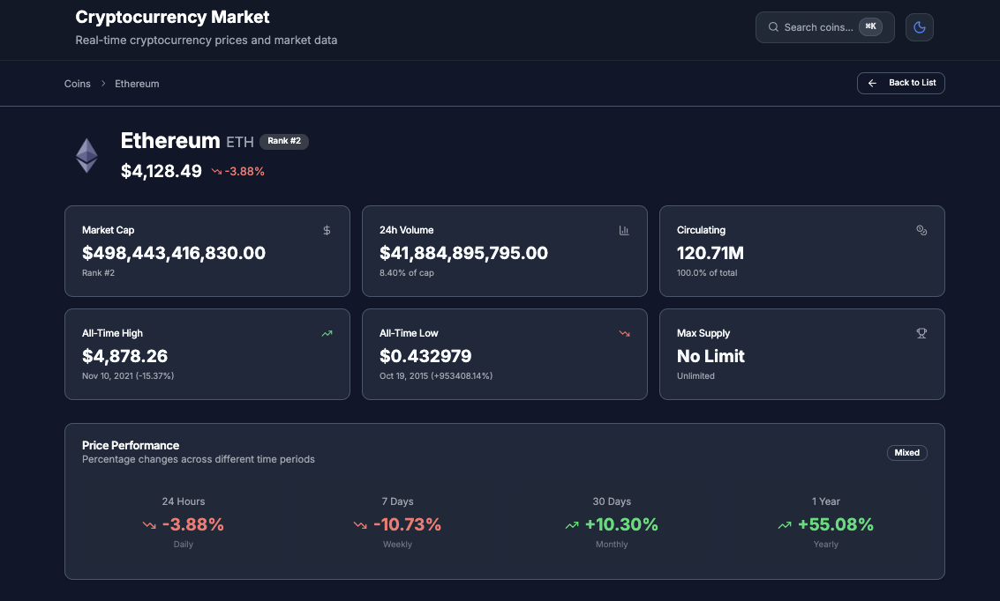
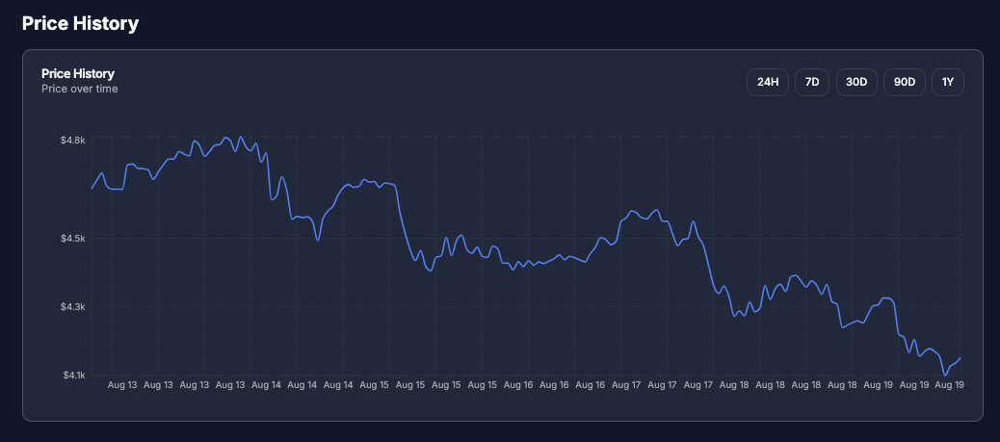
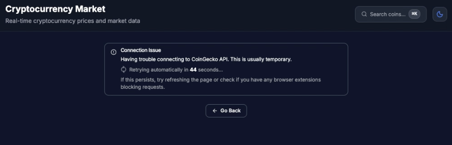
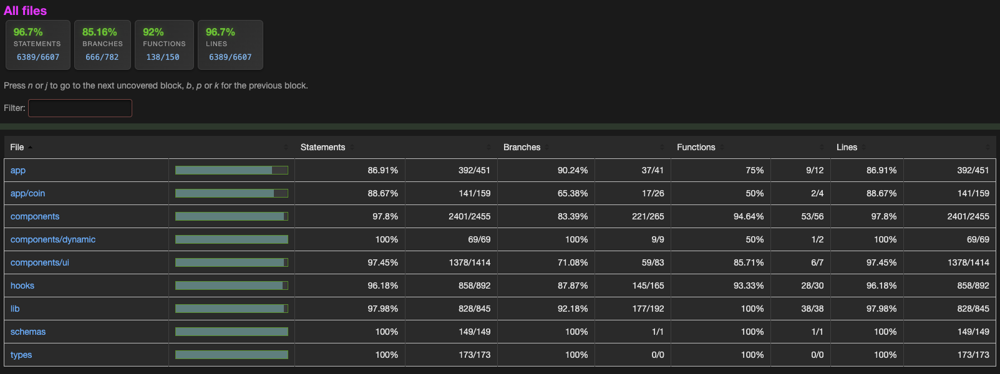

# Cryptocurrency Market Data Dashboard

A high-performance SPA built with **Next.js 15**, **React 19**, and **TypeScript**, showcasing real-time crypto market data via the **CoinGecko v3** API.

[](https://github.com/mario-digital/Saga_FE_CoinGecko/actions)


---

## Executive Summary

- **Spec-first:** static export + CSR (no API routes) per challenge rules.
- **Data integrity:** Zod schemas at the **network boundary**; components only consume validated DTOs.
- **Resilience:** typed error taxonomy, explicit **429** handling, **retry** UI, and request cancellation.
- **Performance:** pagination, dynamic `import()` for charts, preconnect/dns-prefetch; budgeted for LCP/TBT.
- **Quality gates:** 96.7% coverage (85% branches); `pnpm verify:full` (type-check + lint + coverage) runs locally and in CI.

---

## Screenshots

- ###### Home

<p align="center">
  
</p>

- ###### Search Filter

<p align="center">
  
</p>

- ###### Detail Header

<p align="center">
  
</p>

- ###### Price Chart

<p align="center">
  
</p>

- ###### Backoff retry

<p align="center">
  
</p>

- ###### Summary
<p align="center">
  
</p>

---

## Modes (Trade-offs)

| Concern       | Spec Mode (submission)             | Production Mode (reference on `production-mode` branch) |
| ------------- | ---------------------------------- | ------------------------------------------------------- |
| Deploy        | Static export (`output: 'export'`) | Same, plus proxy for API                                |
| Data fetching | CSR direct to CoinGecko            | Edge/API **proxy** w/ caching & CORS control            |
| Rate limits   | Backoff + UI retry                 | Honor `Retry-After`, central quota, cache               |
| SEO           | CSR only                           | SSR/ISR for key routes + canonical tags                 |
| Observability | Dev-console                        | Sentry + error boundaries                               |

---

## Technical Architecture

- **Framework**: Next.js 15.x (App Router, Static Export)
- **Runtime**: React 19.x
- **Language**: TypeScript (strict)
- **UI**: shadcn/ui (Radix primitives)
- **Styling**: Tailwind CSS
- **Data**: SWR (stale-while-revalidate)
- **Charts**: Recharts
- **Testing**: Jest + React Testing Library

---

## Data Integrity & Contracts

External API data is **validated at the boundary** with **Zod**:

```ts
// src/schemas/coingecko.ts (excerpt)
import { z } from 'zod';

export const CoinSchema = z.object({
  id: z.string(),
  symbol: z.string(),
  name: z.string(),
  image: z.string().url().optional(),
  current_price: z.number(),
  market_cap: z.number().nullable(),
  total_volume: z.number().nullable(),
  price_change_percentage_24h: z.number().nullable(),
});

export const CoinsResponseSchema = z.array(CoinSchema);
export type CoinDTO = z.infer<typeof CoinSchema>;
```

```ts
// src/lib/api.ts (excerpt)
const json = await res.json();
const parsed = CoinsResponseSchema.safeParse(json);
if (!parsed.success) throw new APIValidationError(parsed.error.issues);
return parsed.data; // components only see validated DTOs
```

**Contract tests** assert: valid payload → parsed DTO; missing/invalid fields → `APIValidationError`; HTTP **429/404** bubble predictably.

---

## Architecture Overview

```
src/
├─ app/                      # Next.js App Router
│  ├─ coin/                  # Dynamic coin detail routes
│  ├─ layout.tsx             # Root layout with providers
│  └─ page.tsx               # Home page (coin listing)
├─ components/               # Presentational UI
│  ├─ ui/                    # Primitive UI components
│  ├─ CoinCard.tsx           # Individual coin display card
│  ├─ SwipeableCoinCard.tsx  # Mobile swipeable cards
│  ├─ CoinDetailHeader.tsx   # Coin detail page header
│  ├─ CoinDetailError.tsx    # Error handling component
│  ├─ PriceHistoryChart.tsx  # Price chart component
│  ├─ FilterMarketCap.tsx    # Market cap filtering
│  ├─ Pagination.tsx         # Page navigation
│  ├─ SearchCommand.tsx      # Search functionality
│  └─ Header.tsx             # App header with search
├─ hooks/                    # Custom React hooks (SWR + transforms)
│  ├─ useCoins.ts
│  ├─ useCoinDetail.ts
│  ├─ usePriceHistory.ts
│  └─ useVirtualScroll.ts
├─ lib/                      # Utilities
│  ├─ api.ts                 # Fetch → validate → DTO
│  ├─ constants.ts           # Configuration
│  └─ utils.ts               # Helpers
└─ schemas/                  # Runtime validation + inferred types
   └─ coingecko.ts           # Zod schemas + z.infer DTOs
```

### Component Architecture

- **Presentation** components render UI only.
- **Hooks** encapsulate business logic and side-effects; server-state stays in SWR.
- **Containers** (where used) wire hooks to presentational components.

Example pattern:

```ts
// Hook (business logic)
export function useCoins(page: number) {
  const { data, error, isLoading, mutate } = useSWR(
    [`coins-${page}`, page],
    ([_, page]) => api.getCoins(page),
    SWR_CONFIG
  );
  return { coins: data, error, isLoading, retry: mutate };
}

// Component (presentation)
export function HomePage() {
  const { coins, isLoading, error } = useCoins(page);
  if (isLoading) return <CoinCardSkeleton />;
  if (error) return <CoinDetailError error={error} />;
  return (
    <div className="grid grid-cols-1 sm:grid-cols-2 lg:grid-cols-3">
      {coins.map(coin => <CoinCard key={coin.id} coin={coin} />)}
    </div>
  );
}
```

---

## Error Handling & Resilience

- **Taxonomy:** `HTTPError(429/404/…)`, `APIValidationError`, `NetworkError`.
- **429 strategy:** respect `Retry-After` when present, exponential backoff, pause revalidation, visible retry.
- **Cancellation:** `AbortController` on route/search changes to avoid stale updates.
- **UI states:** distinct **loading / empty / error** branches with actionable retry.

```ts
// SWR retry (excerpt)
onErrorRetry: (error, key, cfg, revalidate, { retryCount }) => {
  if (error.status === 429 || retryCount >= 3) return;
  setTimeout(() => revalidate({ retryCount }), 5000 * 2 ** retryCount);
};
```

---

## Performance Budgets & Tactics

- **Budgets:** LCP < 2.5s, TBT < 200ms (mid-tier hardware).
- **Tactics:** paginated grids, dynamic `import()` for charts, memoized transforms, `preconnect`/`dns-prefetch`.

---

## Testing & CI

- **Scope:** unit (utils/hooks), **contract** (schema boundary), UI states (loading/empty/error), basic a11y checks.
- **Coverage:** **96.7%** statements, **85.16%** branches, **92%** functions; enforced via thresholds.

```bash
pnpm test           # dev
pnpm test:watch     # watch mode
pnpm test:ci        # coverage + single worker (CI)
pnpm verify:fast    # type-check + lint
pnpm verify:full    # type-check + lint + coverage (CI/pre-push)
```

Jest coverage gate (see `jest.config`):

```js
collectCoverage: true,
coverageReporters: ["text","html","json-summary"],
coverageThreshold: { global: { statements: 80, branches: 75, functions: 80, lines: 80 } }
```

---

## Installation

```bash
git clone <repository-url>
cd Saga_FE_CoinGecko
pnpm install
cp .env.local.example .env.local
```

### Environment

```env
NEXT_PUBLIC_COINGECKO_API_KEY=<api-key>        # read-only/demo tier
NEXT_PUBLIC_API_BASE_URL=https://api.coingecko.com/api/v3
NODE_ENV=development
```

---

## Development

```bash
pnpm dev
pnpm verify:fast        # quick local quality gate
pnpm verify:full        # full gate: type-check + lint + tests w/ coverage
pnpm build              # static export build (out/)
```

---

## API Integration (endpoints)

- `GET /coins/markets` — Paginated coin listings
- `GET /coins/{coinId}` — Detailed coin data
- `GET /coins/{coinId}/market_chart` — Historical price data
- `GET /search` — Search

SWR defaults:

```ts
const SWR_CONFIG = {
  revalidateOnFocus: false,
  revalidateOnReconnect: true,
  dedupingInterval: 5000,
  focusThrottleInterval: 5000,
  errorRetryCount: 3,
  errorRetryInterval: 5000,
};
```

---

## Deployment

**Static export configuration** (`next.config.js`):

```js
module.exports = {
  output: 'export',
  trailingSlash: false,
  images: { unoptimized: true },
  compress: true,
  poweredByHeader: false,
};
```

Build & ship:

```bash
pnpm build     # outputs static site to ./out
```

**Primary domain:** https://saga-fe-coin-gecko.vercel.app

Canonical:

```html
<link rel="canonical" href="https://saga-fe-coin-gecko.vercel.app" />
```

---

## Development Methodology

> Note: I used AI tools for boilerplate and test scaffolding; architecture, data contracts, and resilience patterns were implemented and reviewed manually.

Workflow: PRD → component-driven implementation → tests (unit/contract/UI) → perf tuning → docs.

---

## Security & Ops (production posture)

- No secrets in client; API keys are read-only demo tier.
- CSP hardening and Sentry with PII scrubbing in production.
- Dependency audit in CI.

---

## Browser Support

- Chrome 90+, Firefox 88+, Safari 14+, Edge 90+, modern mobile browsers.

---

## Challenge Requirements → Implementation

| Requirement                                              | Where                                               |
| -------------------------------------------------------- | --------------------------------------------------- |
| Static SPA (no API routes), deployable to CDN            | `next.config.js (output: 'export')`, Vercel         |
| ≥3 components + search/filter                            | `src/components/*`, `SearchBar.tsx`, `CoinList.tsx` |
| Loading / Empty / Error states                           | `src/app/page.tsx` (distinct branches + retry)      |
| Basic unit tests for hooks/components (+ contract tests) | `src/lib/__tests__/*`                               |
| README + deployment instructions                         | `README.md`, `DEPLOYMENT.md`                        |

---

## License

Proprietary — All rights reserved

## Acknowledgments

Built with Next.js, React, and TypeScript. Cryptocurrency data provided by CoinGecko API.
