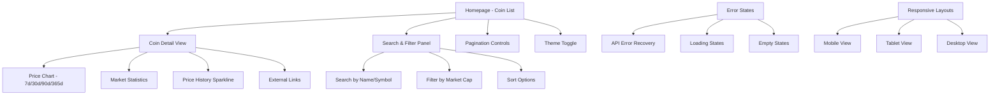
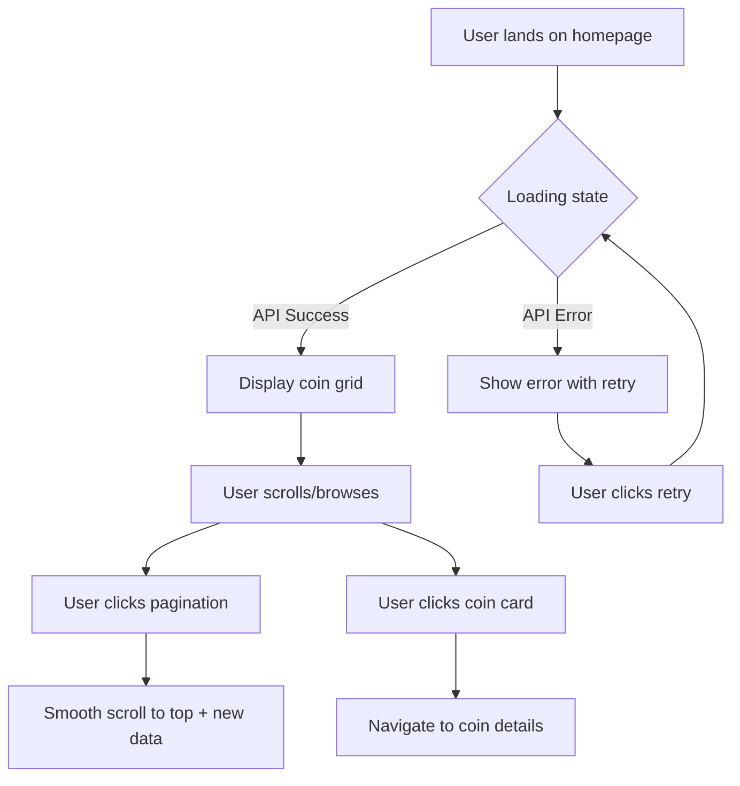
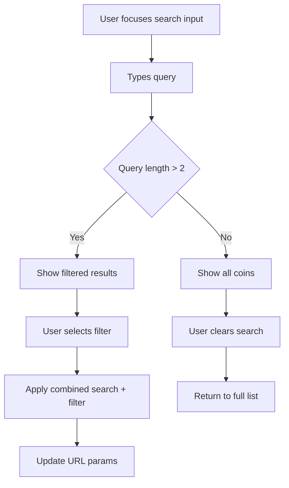
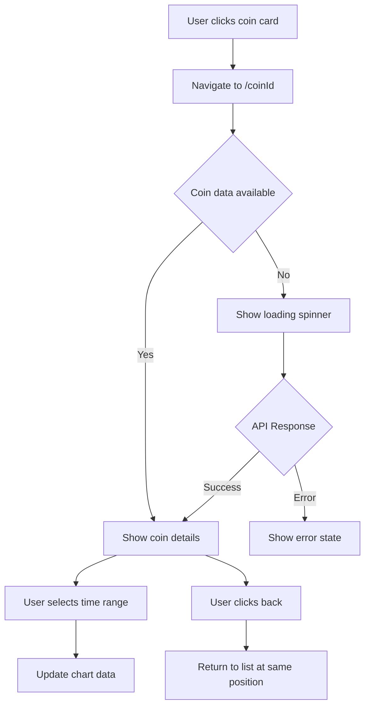

# Saga FE Coin Gecko UI/UX Specification

This document defines the user experience goals, information architecture, user flows, and visual design specifications for **Saga FE Coin Gecko**'s user interface. It serves as the foundation for visual design and frontend development, ensuring a cohesive and user-centered experience.

## Overall UX Goals & Principles

### Target User Personas

1. **Developers & Interviewers** - Technical professionals evaluating React/Next.js proficiency, clean architecture, and code clarity
2. **Technical Recruiters** - Evaluating frontend competency and project organization
3. **Crypto Enthusiasts** - Casual users interested in browsing top cryptocurrencies and market trends
4. **Self-assessment Users** - Developers using this as a learning/demonstration tool

### Usability Goals

- **Immediate Comprehension**: Users can understand crypto data presentation within 30 seconds
- **Efficient Navigation**: Power users can access coin details and historical data with minimal clicks
- **Error Resilience**: Clear feedback for API failures, loading states, and edge cases
- **Mobile-First Experience**: Seamless functionality across all device sizes
- **Data Clarity**: Complex financial data presented in digestible, scannable formats

### Design Principles

1. **Data-First Design** - Prioritize clear, scannable presentation of cryptocurrency metrics
2. **Progressive Enhancement** - Core functionality works without JavaScript, enhanced with rich interactions
3. **Performance Consciousness** - Every design decision considers impact on load time and interaction speed
4. **Accessible by Default** - WCAG AA compliance built into every component and interaction
5. **Consistent Mental Models** - Use familiar patterns from established crypto platforms (CoinGecko, CoinMarketCap)

### Change Log

| Date       | Version | Description                 | Author            |
| ---------- | ------- | --------------------------- | ----------------- |
| 2025-08-04 | 1.0     | Initial UI/UX specification | Sally (UX Expert) |

## Information Architecture (IA)

### Site Map / Screen Inventory

### Navigation Structure

**Primary Navigation:** Single-page application with state-based navigation. Main coin list as the primary interface. Coin detail views accessed via card interactions. No traditional menu - focus on content discovery.

**Secondary Navigation:** Search/filter controls prominently placed. Pagination for data browsing. Theme toggle in header area. Historical range selectors within coin details.

**Breadcrumb Strategy:** Minimal breadcrumbs: "Home > [Coin Name]" for detail views. Clear "back to list" functionality. Maintain scroll position when returning to list.

## User Flows

### Browse and Discover Cryptocurrencies

**User Goal:** Find and explore cryptocurrency data quickly and efficiently

**Entry Points:**

- Direct URL access to homepage
- Returning user with localStorage theme preference
- Search engine or bookmark access

**Success Criteria:**

- User can see cryptocurrency data within 3 seconds
- Can navigate through paginated results smoothly
- Theme preference is remembered across sessions

#### Flow Diagram

#### Edge Cases & Error Handling:

- API rate limit exceeded → Show friendly message with retry timer
- Network connectivity issues → Offline indicator with retry option
- Empty API response → "No data available" state with refresh button
- Slow API response → Progressive loading with skeleton states
- Invalid pagination parameters → Reset to page 1 with notification

### Search and Filter Cryptocurrencies

**User Goal:** Find specific cryptocurrencies or narrow down results by criteria

**Entry Points:**

- Search input in header/navigation area
- Filter dropdown/panel access
- Keyboard shortcut (Cmd/Ctrl + K) for power users

**Success Criteria:**

- Instant search results as user types
- Clear filter state indication
- Easy reset/clear functionality

#### Flow Diagram

#### Edge Cases & Error Handling:

- No search results found → Helpful "try different keywords" message
- Search query too short → Show hint about minimum characters
- Filter combination returns empty → Suggest alternative filters
- Special characters in search → Proper encoding and validation

### View Cryptocurrency Details

**User Goal:** Get comprehensive information about a specific cryptocurrency

**Entry Points:**

- Click coin card from main list
- Direct URL access to coin detail page
- Browser back/forward navigation

**Success Criteria:**

- Detailed data loads within 2 seconds
- Historical chart renders correctly
- User can easily return to main list

#### Flow Diagram

#### Edge Cases & Error Handling:

- Invalid coin ID → 404 page with search suggestions
- Chart data unavailable → Show price data without chart
- Historical data incomplete → Display available range only
- User navigates with browser buttons → Maintain proper state

## Wireframes & Mockups

**Primary Design Files:** Recommend Figma for detailed wireframes and component documentation, with shadcn/ui as the foundation for rapid prototyping and development.

### Key Screen Layouts

#### Homepage - Cryptocurrency List

**Purpose:** Primary interface for browsing and discovering cryptocurrencies

**Key Elements:**

- Header with app title, search input, and theme toggle
- Responsive grid of cryptocurrency cards (4-col desktop, 2-col tablet, 1-col mobile)
- Pagination controls at bottom
- Loading skeletons using shadcn/ui skeleton components
- Error states with shadcn/ui alert components

**Interaction Notes:** Hover effects on cards, smooth pagination transitions, search with debounced input

**shadcn/ui Components:** Card, Input, Button, Skeleton, Alert, Badge

#### Cryptocurrency Detail View

**Purpose:** Comprehensive view of individual cryptocurrency data

**Key Elements:**

- Coin header with logo, name, symbol, and current price
- Interactive price chart with time range selectors (7d/30d/90d/365d)
- Statistics grid showing market cap, volume, price changes
- External links section
- Back navigation breadcrumb

**Interaction Notes:** Chart interactions, smooth time range transitions, responsive layout adaptation

**shadcn/ui Components:** Card, Tabs, Button, Badge, Separator, Breadcrumb

#### Search & Filter Interface

**Purpose:** Advanced discovery and filtering capabilities

**Key Elements:**

- Command palette-style search (Cmd+K shortcut)
- Filter dropdowns for market cap ranges
- Sort options (price, market cap, 24h change)
- Clear filters functionality
- Real-time search results

**Interaction Notes:** Keyboard navigation, instant search feedback, filter state persistence

**shadcn/ui Components:** Command, Dialog, Select, Input, Button, Checkbox

## Component Library / Design System

**Design System Approach:** Adopt shadcn/ui as the foundational component library with custom extensions for cryptocurrency-specific components.

### Core Components

#### CoinCard Component

**Purpose:** Display cryptocurrency information in a scannable, interactive format

**Variants:** Default, Compact (mobile), Featured (trending)

**States:** Default, Hover, Loading (skeleton), Error, Selected

**Usage Guidelines:** Primary component for coin list display. Use hover states for interactivity hints. Loading states should match card dimensions exactly.

#### PriceChart Component

**Purpose:** Interactive price history visualization with multiple time ranges

**Variants:** Line chart, Sparkline (card view), Area chart (detail view)

**States:** Loading, Error, No data, Interactive (with tooltips)

**Usage Guidelines:** Always provide fallback for missing data. Maintain consistent color coding for positive/negative changes.

#### SearchCommand Component

**Purpose:** Global search interface with keyboard shortcuts

**Variants:** Overlay (Cmd+K), Inline (header), Mobile drawer

**States:** Closed, Open, Loading results, No results, Results populated

**Usage Guidelines:** Implement keyboard navigation. Provide search suggestions for better discoverability.

## Branding & Style Guide

### Visual Identity

**Brand Guidelines:** Extend your existing Tailwind configuration while maintaining professional cryptocurrency application aesthetics.

### Color Palette

| Color Type | Hex Code              | Usage                                 |
| ---------- | --------------------- | ------------------------------------- |
| Primary    | #2563eb (blue-600)    | Action buttons, links, focus states   |
| Secondary  | #6b7280 (gray-500)    | Supporting text, secondary actions    |
| Accent     | #3b82f6 (blue-500)    | Highlights, active states             |
| Success    | #10b981 (emerald-500) | Positive price changes, confirmations |
| Warning    | #f59e0b (amber-500)   | Cautions, important notices           |
| Error      | #ef4444 (red-500)     | Negative price changes, errors        |
| Neutral    | #f9fafb to #111827    | Backgrounds, borders, text hierarchy  |

### Typography

#### Font Families

- **Primary:** Inter (already configured)
- **Secondary:** Inter (consistent across all text)
- **Monospace:** ui-monospace, 'SF Mono' (for price displays)

#### Type Scale

| Element | Size            | Weight | Line Height |
| ------- | --------------- | ------ | ----------- |
| H1      | 2.25rem (36px)  | 700    | 1.2         |
| H2      | 1.875rem (30px) | 600    | 1.3         |
| H3      | 1.5rem (24px)   | 600    | 1.4         |
| Body    | 1rem (16px)     | 400    | 1.5         |
| Small   | 0.875rem (14px) | 400    | 1.4         |

### Iconography

**Icon Library:** Lucide React (integrates seamlessly with shadcn/ui)

**Usage Guidelines:** Use 16px icons for inline text, 20px for buttons, 24px for emphasis. Maintain consistent stroke width of 2px.

### Spacing & Layout

**Grid System:** CSS Grid with 12-column layout, responsive breakpoints

**Spacing Scale:** 4px base unit (0.25rem) following Tailwind's spacing scale

## Accessibility Requirements

### Compliance Target

**Standard:** WCAG 2.1 AA compliance with enhanced focus on financial data accessibility

### Key Requirements

**Visual:**

- Color contrast ratios: 4.5:1 for normal text, 3:1 for large text
- Focus indicators: 2px solid blue ring with 2px offset
- Text sizing: Minimum 16px, scalable to 200% without horizontal scrolling

**Interaction:**

- Keyboard navigation: Full keyboard accessibility, logical tab order
- Screen reader support: Proper ARIA labels, live regions for dynamic content
- Touch targets: Minimum 44px touch targets on mobile

**Content:**

- Alternative text: All coin logos include descriptive alt text
- Heading structure: Logical heading hierarchy (H1 → H2 → H3)
- Form labels: All form inputs properly labeled and associated

### Testing Strategy

Automated testing with axe-core, manual keyboard navigation testing, screen reader testing with NVDA/VoiceOver for cryptocurrency data presentation.

## Responsiveness Strategy

### Breakpoints

| Breakpoint | Min Width | Max Width | Target Devices              |
| ---------- | --------- | --------- | --------------------------- |
| Mobile     | 320px     | 767px     | Phones, small tablets       |
| Tablet     | 768px     | 1023px    | Tablets, small laptops      |
| Desktop    | 1024px    | 1439px    | Laptops, desktop monitors   |
| Wide       | 1440px    | -         | Large monitors, 4K displays |

### Adaptation Patterns

**Layout Changes:** 4-col → 2-col → 1-col grid for coin cards. Stack chart and stats vertically on mobile.

**Navigation Changes:** Hamburger menu for mobile, inline search on desktop, bottom navigation for primary actions on mobile.

**Content Priority:** Hide less critical data on smaller screens, show abbreviated coin names, prioritize price and percentage changes.

**Interaction Changes:** Touch-friendly tap targets, swipe gestures for pagination on mobile, hover states disabled on touch devices.

## Animation & Micro-interactions

### Motion Principles

Subtle, purposeful animations that enhance usability without causing distraction. All animations respect `prefers-reduced-motion` user preferences.

### Key Animations

- **Card Hover:** Scale(1.02) transformation (Duration: 150ms, Easing: ease-out)
- **Page Transitions:** Fade in content (Duration: 200ms, Easing: ease-in-out)
- **Loading States:** Pulse animation for skeletons (Duration: 1s, Easing: ease-in-out, infinite)
- **Price Changes:** Color transition for positive/negative changes (Duration: 300ms, Easing: ease-out)
- **Chart Interactions:** Smooth line drawing animation (Duration: 500ms, Easing: ease-out)

## Performance Considerations

### Performance Goals

- **Page Load:** < 2 seconds on 3G connection
- **Interaction Response:** < 100ms for UI feedback
- **Animation FPS:** Consistent 60fps for all animations

### Design Strategies

Implement progressive loading with skeleton states, lazy load coin images, optimize chart rendering with canvas/SVG hybrid approach, use shadcn/ui's built-in performance optimizations.

## Next Steps

### Immediate Actions

1. Install and configure shadcn/ui with your existing Tailwind setup
2. Create Figma design file with component library documentation
3. Begin component migration starting with CoinCard using shadcn/ui Card
4. Implement search functionality using shadcn/ui Command component
5. Add comprehensive loading and error states using shadcn/ui components

### Design Handoff Checklist

- [x] All user flows documented
- [x] Component inventory complete
- [x] Accessibility requirements defined
- [x] Responsive strategy clear
- [x] Brand guidelines incorporated
- [x] Performance goals established

---

_This specification was created by Sally (UX Expert) as part of the BMad agent workflow for comprehensive frontend planning._
